# この先生きのこるガイド　企画

    
    

        

            <b>ぽにょ @ponyoxa</b>
			<a href="https://X.com/ponyoxa">@ponyoxa</a>
        

    

だいたいバックエンドエンジニアをやっていましたが、最近はもっといろいろなことをやるようになってきました。電子工作、バイクが気になっています。自宅サーバーも立てたい。やりたいことだらけで困る日々。

# きのこカンファレンス2026　コアスタッフ

    
    

        

            <b>ariaki</b>
			<a href="https://X.com/ariaki4dev">@ariaki4dev</a>
        

    

「誰もが未来に漠然とした不安があるんじゃないか」という思いからカンファレンス実施の検討をはじめ、そして今日、日本科学未来館というめちゃくちゃ素晴らしい会場で第2回を開催できることにすごく興奮しています。みんなで生きのころう！

    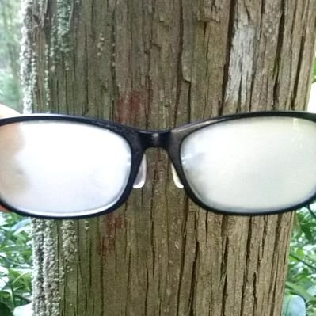
    

        

            <b>yoji</b>
			<a href="https://X.com/YoujiO3">@YoujiO3</a>
        

    

医療系の事業会社で働くエンジニアです。最近BEエンジニア始めました。 
若輩ですが、長くエンジニア生を楽しみたいと思っており、色々勉強させていただきたいと思っています！

    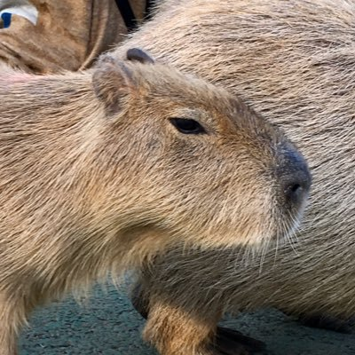
    

        

            <b>こうの</b>
			<a href="https://X.com/hk_it7">@hk_it7</a>
        

    

きのこカンファレンスのコアスタッフ。主にセッション周り等を担当。お仕事ではサーバーサイドメインになんでもやるタイプのテックリード。

    
    

        

            <b>やし</b>
			<a href="https://X.com/yashi848484">@yashi848484</a>
        

    

前回のきのこカンファレンスにオーディエンスとして参加し、このカンファレンス自体が「生きのこって」ほしいと思いコアスタッフに参加しました。今回主にノベルティを担当しています！ 
お仕事ではWebフロントエンドを中心に、テックリードとして働いております。

    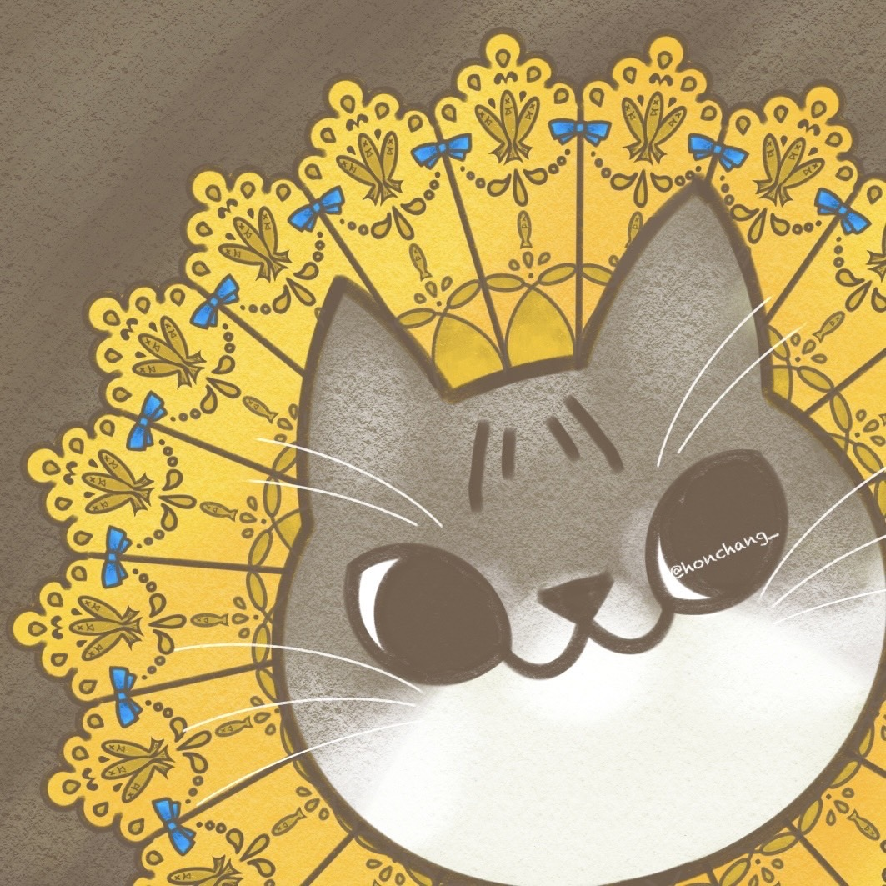
    

        

            <b>honchang</b>
			<a href="https://X.com/honchang_">@honchang_</a>
        

    

生きのこりたい…まだ生きていたい… 
採用、技術広報の界隈にいたため、キャリアを作る・考えるということへ関心があります

    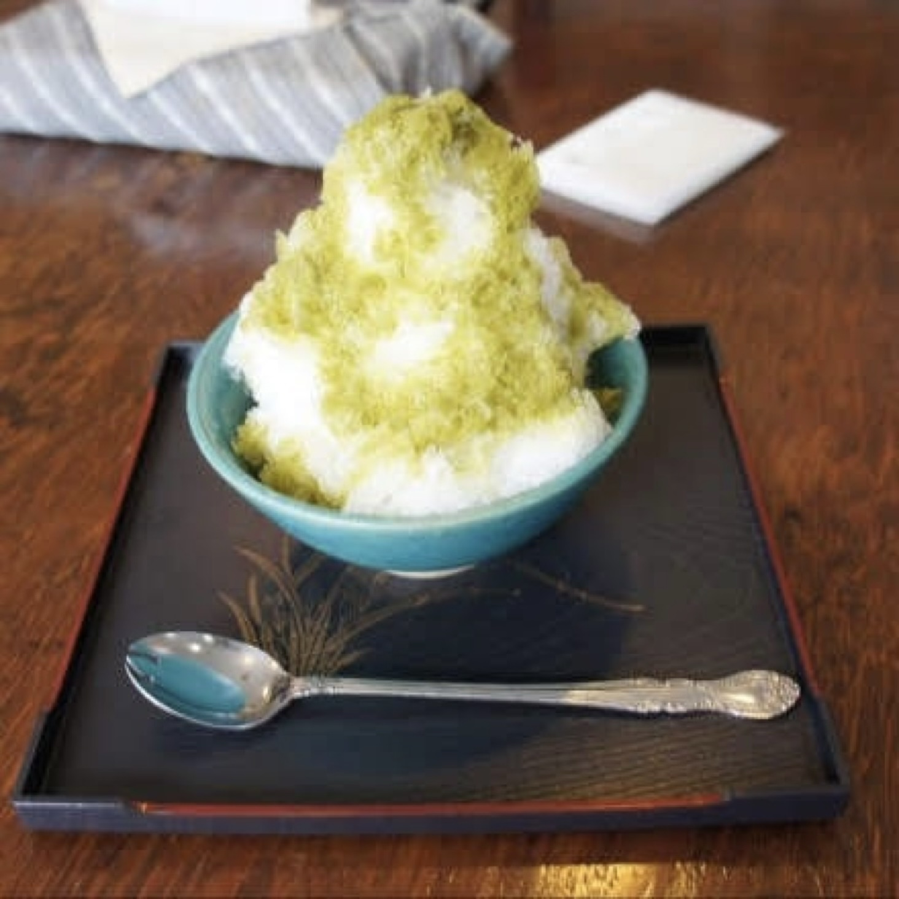
    

        

            <b>Magnolia.K</b>
			<a href="https://X.com/magnolia_k_">@magnolia_k_</a>
        

    

普段は、「吉祥寺.pm」の中の人としてイベント運営をやっています。 
　きのこカンファレンスでは、その誕生の瞬間に立ち会ったご縁でコアスタッフをやっています。 
　自分が色々なイベントの運営をやっているのは、登壇する人とか、参加する人、色々な人の価値観を一度に知ることができるからです。

    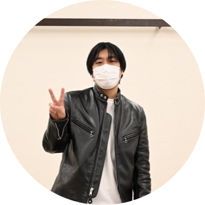
    

        

            <b>hehehenohe</b>
			<a href="https://X.com/shinpei _takano">@shinpei _takano</a>
        

    

エンジニアではないですが、エンジニアが好きなギリギリ人間です。たまにカンファレンスやイベントに顔出しますー。 
　エンジニア以外でも生き残らなきゃなので、色々なアウトプットから刺激を貰えたらと思います！宜しくお願い致します！

    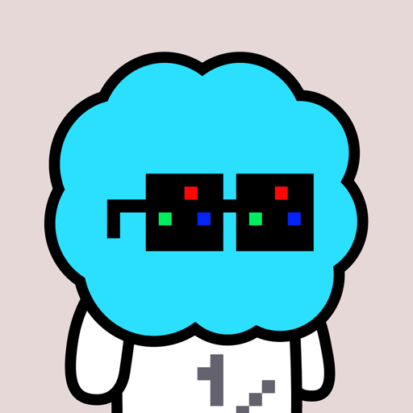
    

        

            <b>KOHE</b>
			<a href="https://X.com/kohe_osaka">@kohe_osaka</a>
        

    

13年間、バリスタとしてコーヒーの世界にいました。JAPAN BARISTA CHAMPIONSHIP公認審査員などいくつかの競技会審査員を経験後、パンデミックを機にエンジニアキャリアチェンジ。現在は六本木でAIとコードを書きながら、どうやって40代を迎えるのか？？を悩んでいます。

    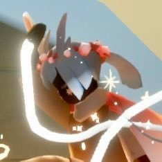
    

        

            <b>yukimura</b>
			<a href="https://X.com/y_ki6ra">@y_ki6ra</a>
        

    

きのこくんを描きました(🍄•᎑•🍄)何卒よろしくお願いします！ 
　お仕事ではクラウドインフラエンジニアみたいなことをやっています。 
　社会人2年目にしてこれからのキャリアをどうしようか分からなくなってきたので、たくさん学ばせていただきたいと思っています。

    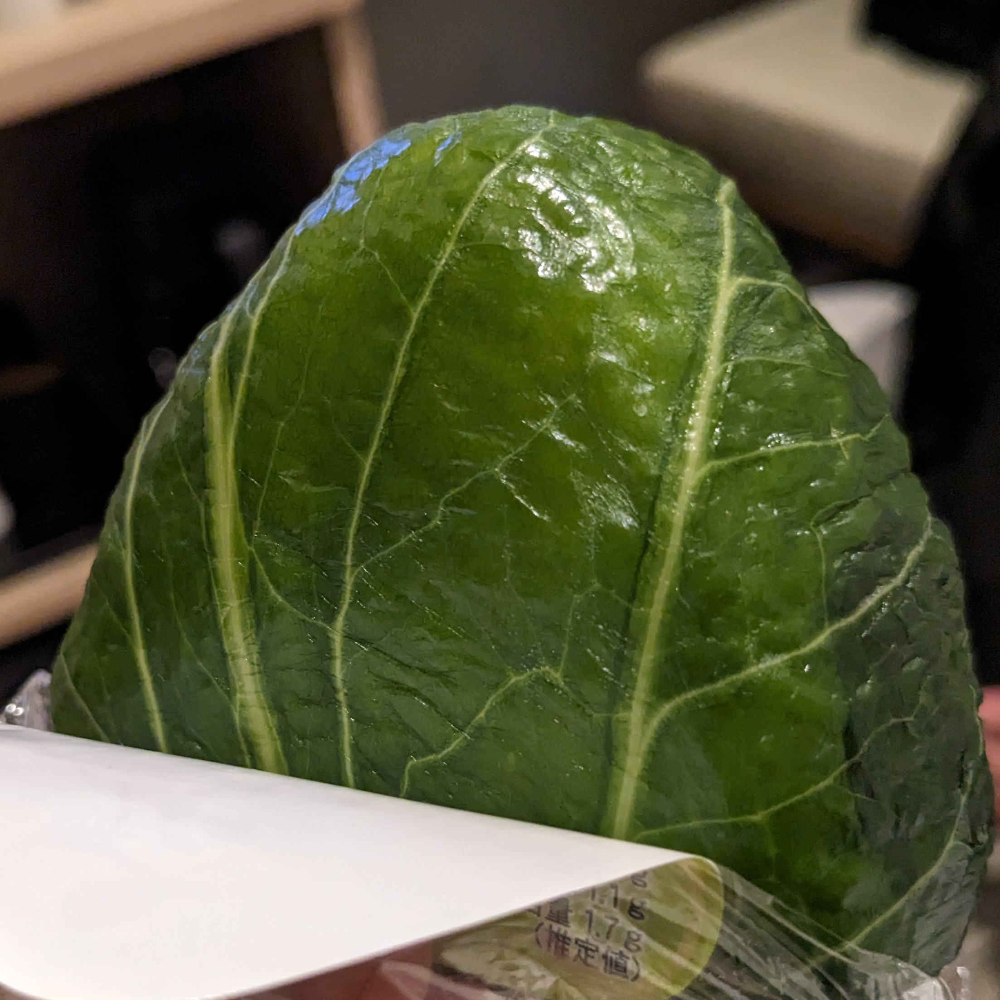
    

        

            <b>kii</b>
			<a href="https://X.com/kii310_nyan">@kii310_nyan</a>
        

    

サーバーサイドをやっています。自分の勉強会が生きのこれるように頑張りたいです。 
　この先も手を動かしてコードを書くことを忘れたくないなと感じています。

    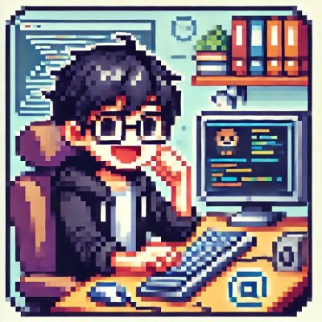
    

        

            <b>nishihara</b>
			<a href="https://X.com/nishihara_job">@nishihara_job</a>
        

    

今月からSIerの会社でソフトウェアエンジニアとして働いています。 
　若輩…と言いづらい年代にはなってきましたが変わらずに凹むことだらけの世の中でジタバタもがいています。 
　みんなで生きのこりましょう！

    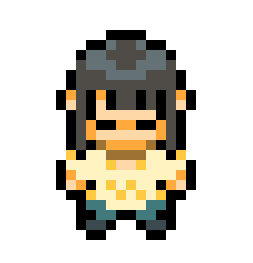
    

        

            <b>tsumichan</b>
			<a href="https://X.com/tsumichan">@tsumichan</a>
        

    

ソフトウェアエンジニアからキャリアをスタートし、現在組織開発や技術広報を担当しています。 
　カンファレンススタッフなどで人を支えることが好きです。

    
    

        

            <b>山田 雄一（ふーれむ）</b>
			<a href="https://X.com/ditflame">@ditflame</a>
        

    

きのこカンファレンスのコアスタッフ。主にガイドブックと広報周り(広報は主にメディアスポンサー記事対応)を担当。 
　お仕事ではテクニカルライティング職 兼 ISMSのルール整備の番人みたいなことをしています。 
　情報処理安全確保支援士(第000594号)、電気通信主任技術者(伝送交換)、データベーススペシャリスト、エンベデッドシステムスペシャリスト　など

# きのこカンファレンス2026　スタッフ

    
    

        

            <b>yussak</b>
        

    

普段はRailsを中心に書いているエンジニアです！
この先生きのこるために技術はもちろんアジャイルやプロダクトマネジメントも勉強中です。今後はプロダクトエンジニアをやっていきたい💪
相撲観戦、将棋観戦、ボドゲが生きがいです！推しは立浪部屋です
よろしくお願いいたします‼️

    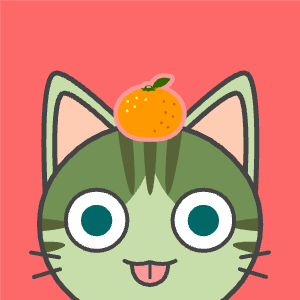
    

        

            <b>まさと</b>
        

    

せっかく参加するならスタッフで！新しい刺激をもらいながら、楽しく生きのこるコツを探します。

    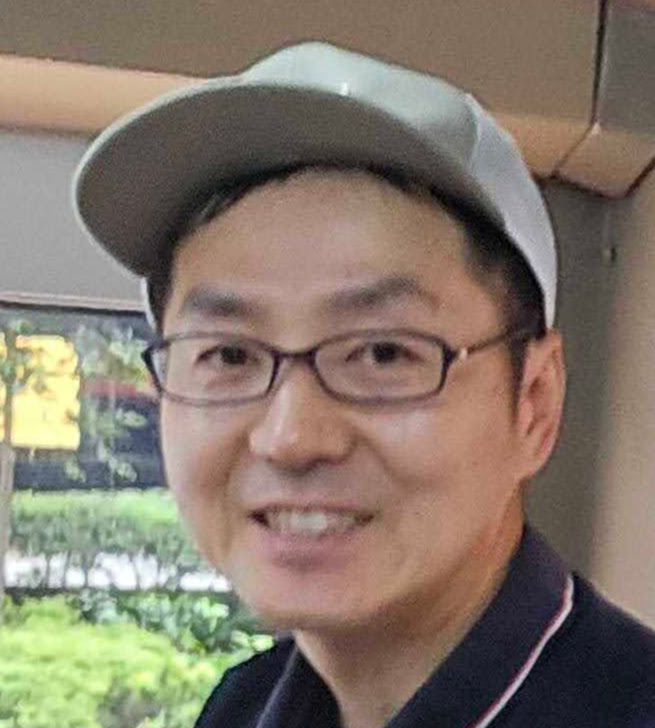
    

        

            <b>にしざわ</b>
        

    

田舎での生きのこりを模索中。普段はReactとRailsを使っています。

    
    

        

            <b>Kaoru</b>
        

    

ペンギン大好きSREです。最近はAIの勉強とかしてます。

    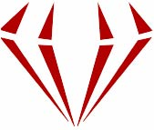
    

        

            <b>piyohiko</b>
        

    

炎上案件と共に成長してきました。今日も生きのこる。次は誰かを助けられるように。

    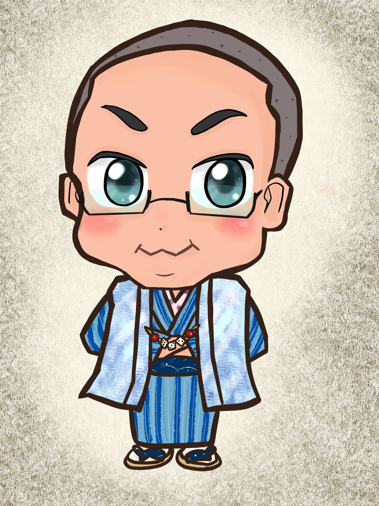
    

        

            <b>白栁隆司</b>
        

    

なんとか四半世紀生きのこってこられました。これからも永く生きのこりたいです。

    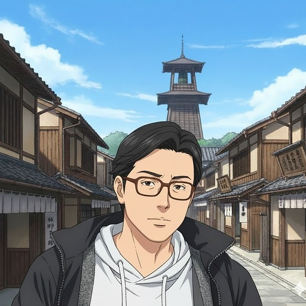
    

        

            <b>さっぴー川原</b>
        

    

もうすぐ還暦！ひであき還暦！って言いながら日本酒飲みながらプログラミングしたい

    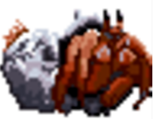
    

        

            <b>こまだ</b>
        

    

基本的にはその場しのぎで生きていきたい

    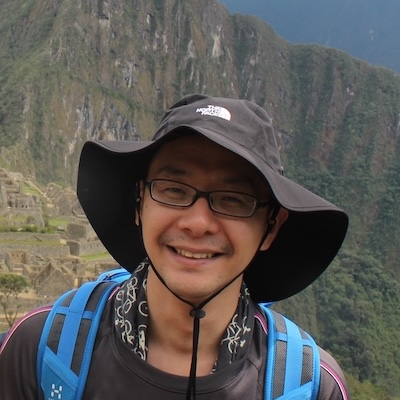
    

        

            <b>杉山貴章</b>
        

    

生きのこりへの近道は、コミュニティ活動に参加すること

    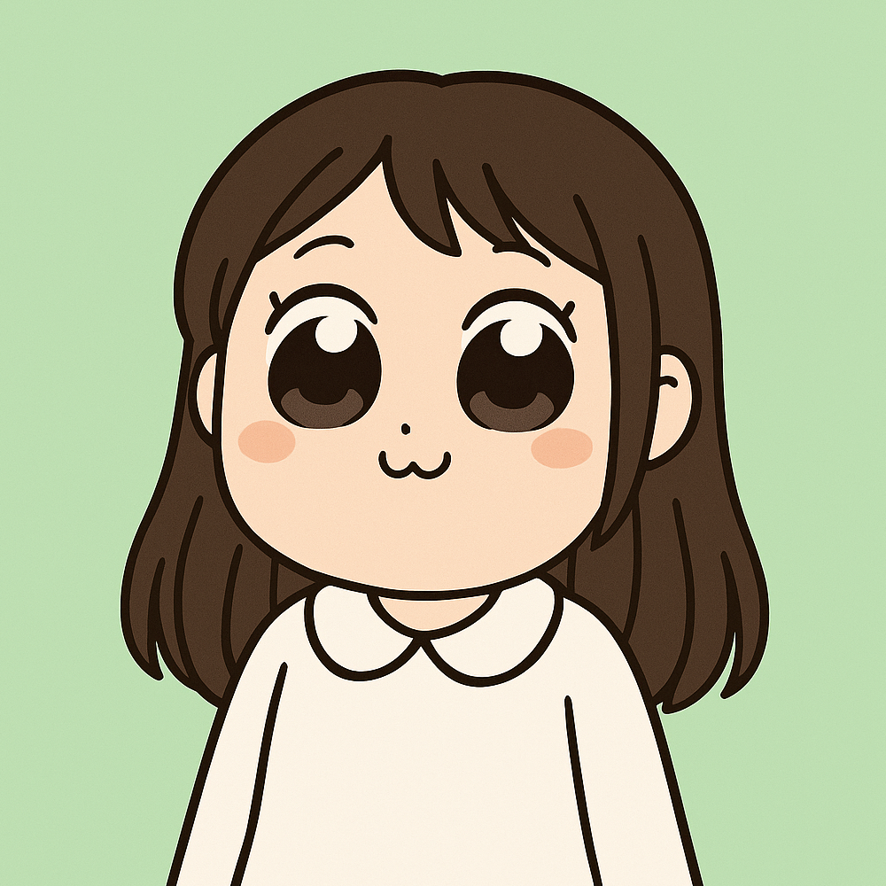
    

        

            <b>natty</b>
        

    

旅が生きがい。私のアナザースカイ探し中。生きのこって、ぜったいに見つけたい！

    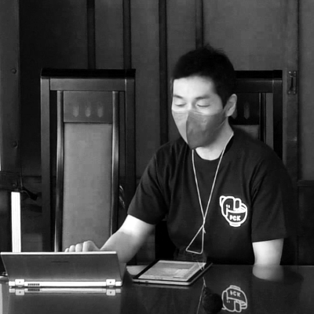
    

        

            <b>fkuMnk</b>
        

    

最近お勧めの連載漫画は伴天連怪談とガチャンキイで、昨年完結したベストコミックスは邪神の弁当屋さんです。	

    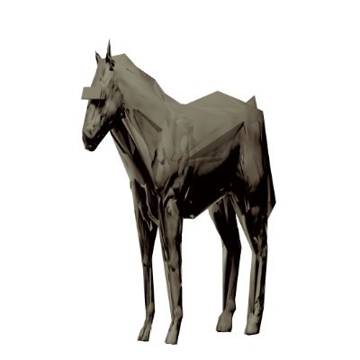
    

        

            <b>梶川 琢馬</b>
        

    

仕事もプライベートも全力で楽しんで生き残る！

    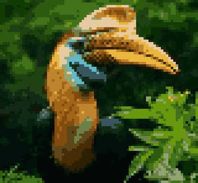
    

        

            <b>satak</b>
        

    

PHPerです。生きのこりたいです。

    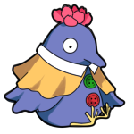
    

        

            <b>げんげん</b>
        

    

エンジニア人生今が一番楽しい◎を更新し続けて、この先もなんとか生き残りたいです…！

    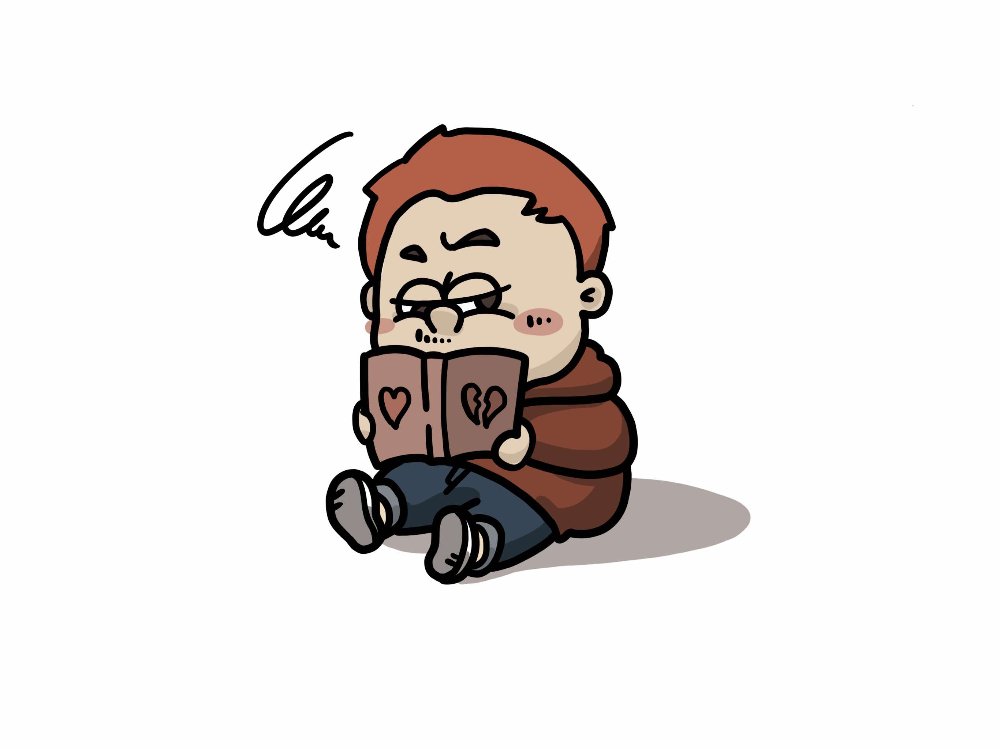
    

        

            <b>たむたむ</b>
        

    

生きるために生き残りたい

    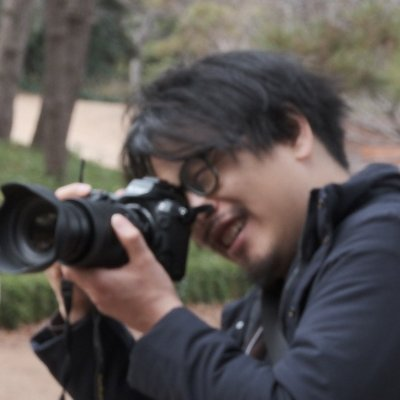
    

        

            <b>nota</b>
        

    

きのこならエリンギがいいなぁ

    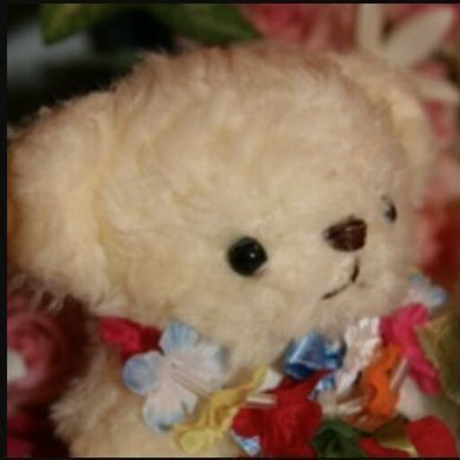
    

        

            <b>にわさと</b>
        

    

AI活用中。なお肝臓は単一障害点です

    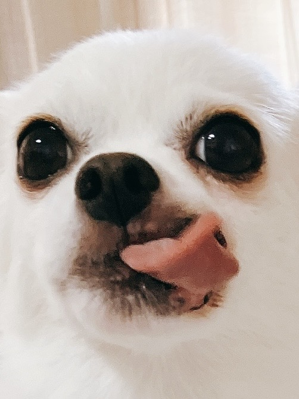
    

        

            <b>てらうちたかし</b>
        

    

生き残りをかけてスタッフやらせてもらいます！

    
    

        

            <b>TAP</b>
        

    

いきのこのこのこげんきのこ 
ノリと元気で。

    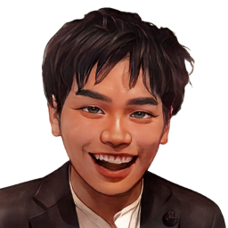
    

        

            <b>どうちん</b>
        

    

みなさんで盛り上げていくことが好きです。エンジニアなりたてなので色々と勉強させてください！

    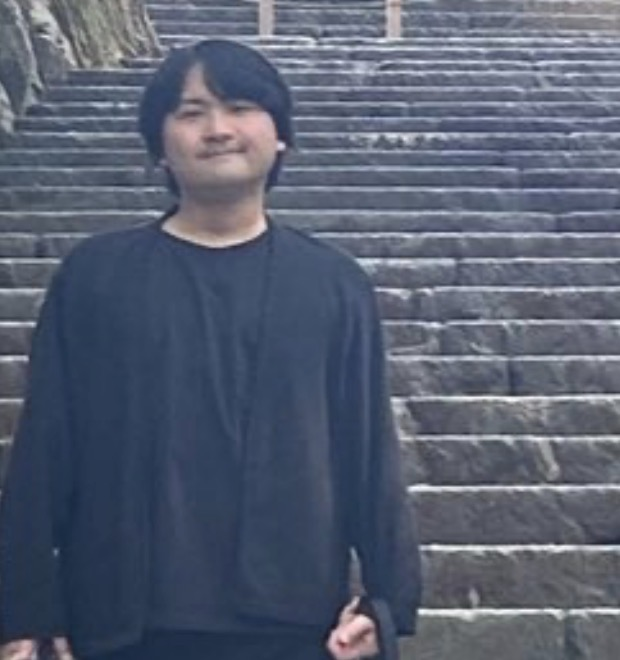
    

        

            <b>長江佳亮</b>
        

    

スタートアップでEMしてます。不確実性の高い世の中だからこそ自分の心が動くほうを選んで生きたい！

    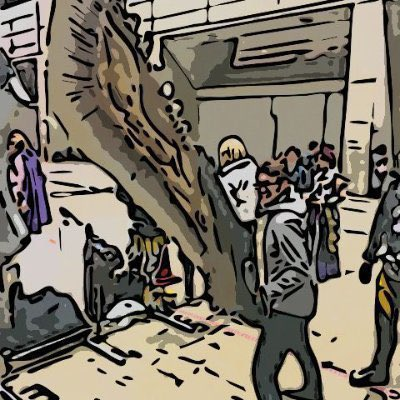
    

        

            <b>KojiKa</b>
        

    

日本酒大好きPHPer！美味しいお酒を長く飲み続けるためにも、適度に頑張らず生きのこります。	

    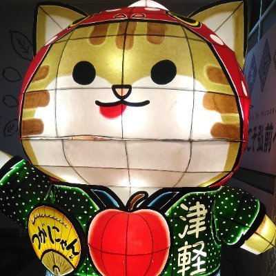
    

        

            <b>おさない</b>
        

    

7月から当日スタッフつながりでお声がけいただいた会社に転職します！
新しい会社でも生き残るぞ！

    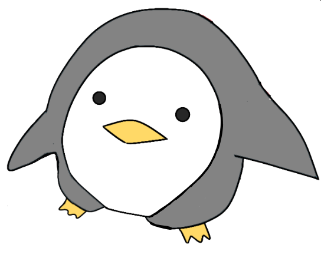
    

        

            <b>ryugen</b>
        

    

医療系のエンジニアです。健全なる精神と肉体で生き残りたい。今年はいろんなイベントに参加したい！！

    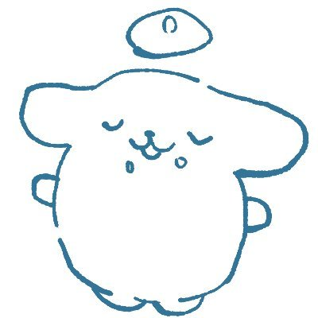
    

        

            <b>はる</b>
        

    

あくなき好奇心が生き残りの秘訣！いろんなことをもっといっぱい知りたい！

## きのこるガイド　編集補助

    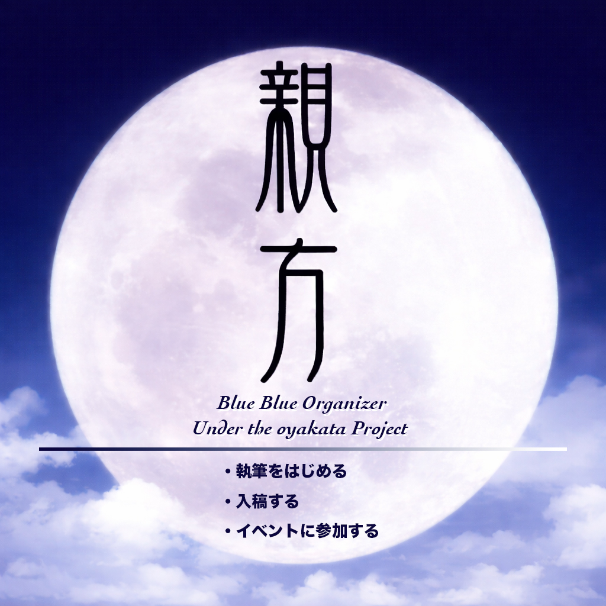
    

        

            <b>親方 </b>
            <a href="https://twitter.com/oyakata2438">X@otakata2438</a>
        

        

            サークル名：親方Project
        

    

ワンストップ本シリーズ企画・編集（一部執筆）してます。コミケと技術書典に出没。ついに技術書同人誌博覧会（技書博）のコアスタッフとして運営側に参加。技術書イベントが増えて嬉しいけれど、イベント多すぎて外出チケットと徳が不足気味。徳を貯めるべく、家事をこなしつつ、ラボに遊びに行ったり、飲み会や懇親会で著者を新規開拓したり。著者募集はいつでもやっていますので、ぜひご参加ください。
