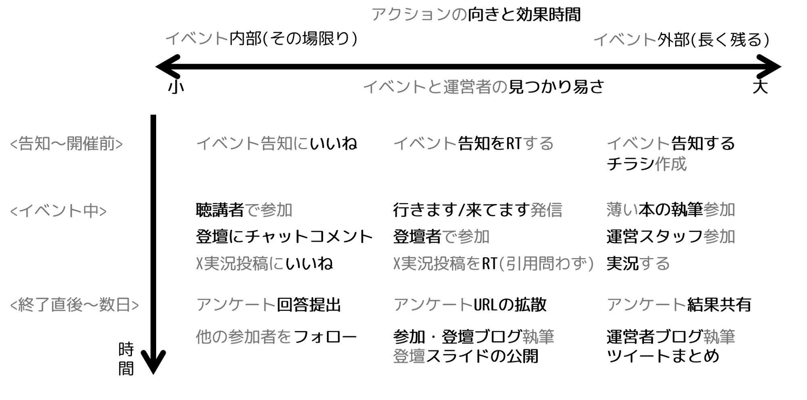

# 生きのこらせることで生きのこる をやったら機会も付いてきた話

じゅん

こんにちは、じゅんです。

HoloLens・VR技術者コミュニティの運営や、若手研究者と開発者コミュニティの橋渡しを8年間続けてきました。かつては「Scientist/Developer Relations」と名乗っていましたが、最近では「InterCommunity Communications for Tech/Science (#InCommComm)」という肩書きで活動しています。これは、エンジニアがそれぞれコミュニティ間を越境し、交流を最大化する活動を指します。いわゆるコミュニティマネジャー(特に地方)の活動とは異なり、自らのコミュニティの拡大にこだわらず、関わった外部コミュニティの文化にフィットするエンジニアの発信者を見つけて両者をめぐり合わせる事などが主な活動となります。

きのこカンファレンスの参加にあたり、生きのこりのヒントになるお話を募集しているとのことを知り、私の8年間の実践で得られた感覚をちょっと共有してみたいと思い、書いてみました。VR方面のエンジニア力が無く、勉強会に関わっていただけとも言える私が活動をゆっくり広げながら8年間活動を継続できた理由は、おそらく自分の発信力の使いどころを他の人の活動を活かすものに強く偏らせているからではないかと考えています。

## 有志活動は脆いという背景を踏まえる

技術者コミュニティの草の根活動は基本的に有志の活動であり、そこに明確な金銭的報酬などは発生しません。本稿を読む方も理解されていると思います。コミュニティ関係者の方々は、金銭とは別の体験を報酬として受け取り、活動を継続しているものと思います。私は活動によって得られる自分自身の新たな機会と、人々の好奇心由来の活動のそばに居られる事を心の栄養にしています。一方で、私は義務感による拘束にはコミュニティを破壊する力があると考えていますのでなるべく離れます。無理なく続く方法を確立していく必要があります。

## 技術コミュニティにおけるアクションをイベント内外への向きで分類する

色々なコミュニティに参加してみると、そのイベントの周りで参加者たちの色々な行動を目にする機会があります。それらを向きと効果時間ごとに配置するとざっくりこんな感じになります(私見)。

{width=100%}

これらのうち、左の列の行動は、イベント中に主に消費され、その盛り上げに寄与します。右の2列の行動は、イベントの前後に行われ、多くの場合はSNSに痕跡が残ります。

いずれも、イベント全体の盛り上げに関わる重要な要素であり、次のイベントが開けるかどうかの境目になります。参加者の集団の性質によって、どの盛り上げに注力すべきかは変わり、例えばクローズドな会がメインであれば、左側のアウトプットを最大化して参加満足度を高め、次回の参加者をその会の参加者に連れてきてもらうモデルをつくるのがよいと思います。逆に敷居の低い会を継続したい場合は右の発信を強めて、コミュニティの外からでも入り込みやすいフックをどんどん残すべきだと考えます。　

私の場合は、セミナーではなく双方的な集まりをやりたいので、必然的に右側のアウトプットを重ねる戦略になります。しかし基本的に運営リソースは足りていません。どうすればいいのでしょうか？

## イベントの中心を自分じゃなくして自分は発信に全振りする(コラボ作戦)

問いの一つの解が外部コミュニティとのコラボで、当日の会場内コミュニケーションをケアする柱になれる人と組みます。私はサブとして働き、準備としては、自分が当日の現場でリアルタイムで拘束されるコミュニケーションを事前根回しなどで未来の自分から巻き取ります。あいたリソースを使って自分自身は発信役として実況やアーカイブの記録作りをリアルタイムで行います。　

これらを見ることになるのは、当該イベントの参加者・登壇者・運営者にくわえ、未来のコラボ相手です。いつでも見れるイベント記録があれば、その後近いテーマの会を開催しそうな人が現れた時に、そのイベント記録を見せれば協調できる可能性が上がりますのでその活用の道をつけておきます。私はこれらの発信を、コラボ相手とそのイベント登壇者の実績として見せられるように積み重ねてきました。そうする事で、「○○のテーマでイベントに関与した△△さん」という痕跡が次の機会を得ることをひっそり設計しています。

### やったことはそのまま返ってこないが、積んだ徳は無駄にならない

趣味ゆえの気楽さでこんな事を続けていますが、皆さんがコミュニティとして生き残ってくれていれば、別の機会に手助けしてくれたり、道外から札幌に来る時に私を思い出してくれたりして、私が地元でイベントを開催するチャンスが必ずあります。ほとんどのDoMCNの地元イベントはこのようなきっかけで始まる事が多く、結果的に他の地域より多くの機会を呼び寄せてきたように思います。

つまり、外部コミュニティの生き残りをサポートしていると自分のコミュニティも活動が継続出来てしまって今に至るというお話でした。

## 今から始められるイベント運営手助けは告知の拡散

現在のXは、かわいい猫のポストとかをいいねしてるとそのうち自分のTLのおすすめ欄が動物だらけになりますよね。これは勉強会でも同じで、告知などをいいねしているとその勉強会関連のハッシュタグポストが増えます。私はXRとほぼ関係ないイベントの告知も条件反射でRTするようにしていて、これは完全に意識してやっています。

エコーチェンバー効果がますます支配的になってきますので、ちまたの人々は自身の意識外のイベントの存在を知る方法が減ってきています。もし、イベント運営者をサポートしたいという気持ちがありましたら、告知をリポストされるだけでも今は相当助かっているという事をお伝えしたいです。

## まとめ

イベント運営者の手が回りにくい領域で外部発信メインのサポートを行った結果、生きのこっているコミュニティのいくつかが自分のイベントも助けてくれて生きのこっているというお話でした。

コミュニティが内部の熱量だけで急拡大すると、それに伴う疲弊や摩擦も大きいので無理には大きくせず、むしろコミュニティ自体は緩やかに墜落するイメージでやっていました。いつでもやめられる体制を維持したので却って疲れないというのも大きいと思います。

皆さんも無理せず徳を積みながらゆるく継続されることを願います。

#### 自己紹介

    
    

        

            <b>じゅん</b>
			<a href="https://x.com/jun_mh4g">@jun_mh4g</a>
        

    

Hokkaido MotionControl Network (#DoMCN) お知らせ担当。XR技術＋周辺技術の領域と科学者コミュニティのスキマを埋める活動。#InCommComm と自称して、外部コミュニティ同士のトンネルを掘り続ける活動も。2023年に『LT秘伝の書(#Engineers_LT)』の執筆に巻き込まれて以来、アウトプット界隈も好き。活動：https://avely.me/jun